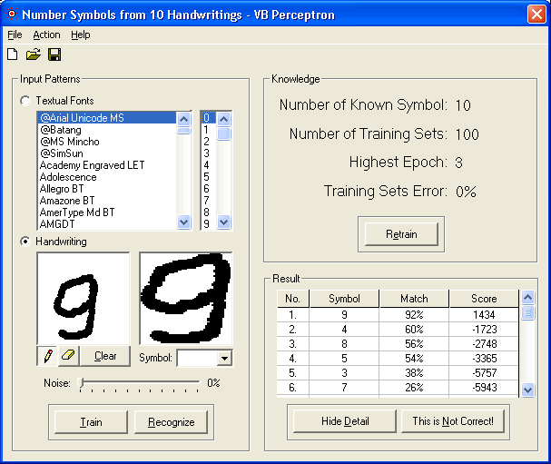



## VB Perceptron

### Description

VB Perceptron is a pattern recognizer program using single layer perceptron. It has the capability to learn patterns and classify them to specified classes. VB Perceptron features: input patterns from installed fonts or handwriting, train the perceptron using input patterns and give information about highest epoch reached and training error percentage, recognize a pattern and give information about the match score and match percentage of each known classes, open and save the perceptron, training options (learning rate, threshold, target error and maximum epochs) and add noise to a pattern.

Note that the perceptron has not been trained yet. You have to train it first before it can be used to recognize any pattern. To train the perceptron select patterns from the font list and symbol list (hold down shift or ctrl to select multiple fonts or symbols) or draw a pattern on the left picture box then press the Train button. To recognize a pattern, simply select a pattern form the list or draw one and then press the Recognize button.

Please report any bugs to me. Your feedback and votes will be very appreciated.
 
### More Info
 

             |
---                |---
**Submitted On**   |2005-01-13 15:43:32
**By**             |[Theo Z](https://github.com/Planet-Source-Code/PSCIndex/blob/master/ByAuthor/theo-z.md)
**Level**          |Advanced
**User Rating**    |5.0 (100 globes from 20 users)
**Compatibility**  |VB 6\.0
**Category**       |[Miscellaneous](https://github.com/Planet-Source-Code/PSCIndex/blob/master/ByCategory/miscellaneous__1-1.md)
**World**          |[Visual Basic](https://github.com/Planet-Source-Code/PSCIndex/blob/master/ByWorld/visual-basic.md)
**Archive File**   |[VB\_Percept1842111202005\.zip](https://github.com/Planet-Source-Code/theo-z-vb-perceptron__1-58278/archive/master.zip)

